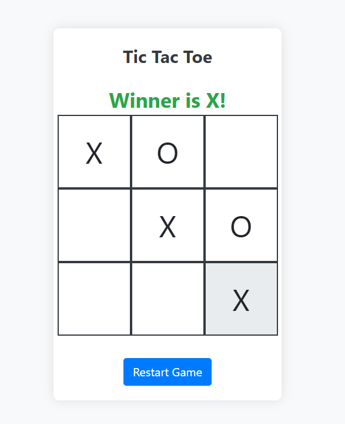

# Tic Tac Toe Game

This is a simple and interactive Tic Tac Toe game built using HTML, CSS, JavaScript, and Bootstrap. The game is designed to provide an engaging user experience with a clean and modern interface.

## Features

- **Responsive Design**: The game adapts to different screen sizes, making it playable on both desktop and mobile devices.
- **Interactive UI**: Visual feedback is provided when a player wins or when there is a draw.
- **Restart Button**: Allows players to reset the game and start a new match with a single click.
- **Dynamic Winner Announcement**: The game announces the winner or a draw with a visually appealing message.

## Preview




## Technologies Used

- **HTML5**: Structure of the game.
- **CSS3**: Custom styling along with Bootstrap for enhanced UI components.
- **JavaScript**: Game logic and interactivity.
- **Bootstrap 4**: Used for responsive design and modern UI components.

## Installation and Usage

1. **Clone the repository**:
   ```bash
   git clone https://github.com/piyanka/tic-tac-toe.git
   ```
   
2. **Navigate to the project directory**:
   ```bash
   cd tic-tac-toe
   ```

3. **Open `index.html` in your web browser**:
   You can simply open the `index.html` file in your preferred web browser to start playing the game.

## Game Instructions

1. The game is played on a 3x3 grid.
2. Player X always goes first.
3. Players take turns to mark a square with their symbol (X or O).
4. The first player to get 3 of their symbols in a row (horizontally, vertically, or diagonally) wins the game.
5. If all 9 squares are filled and no player has 3 symbols in a row, the game ends in a draw.
6. Click the "Restart Game" button to start a new game.

## File Structure

- `index.html`: The main HTML file that contains the structure of the game.
- `style.css`: Contains custom styles for the game. (Note: Included within the `index.html` file).
- `script.js`: The JavaScript file that handles the game logic and interactivity.

## Customization

You can easily customize the look and feel of the game by editing the CSS styles within the `index.html` file. Adjust the size of the grid, colors, fonts, and more to match your preferences.

## Future Improvements

- **AI Opponent**: Implement an AI opponent for single-player mode.
- **Score Tracking**: Add functionality to track the scores of multiple games.
- **Animations**: Enhance the user experience with animations for moves and winner announcements.

## License

This project is open-source and available under the MIT License. Feel free to modify and distribute it as you wish.

---

Enjoy the game! If you have any questions or suggestions, feel free to open an issue or contribute to the project.

